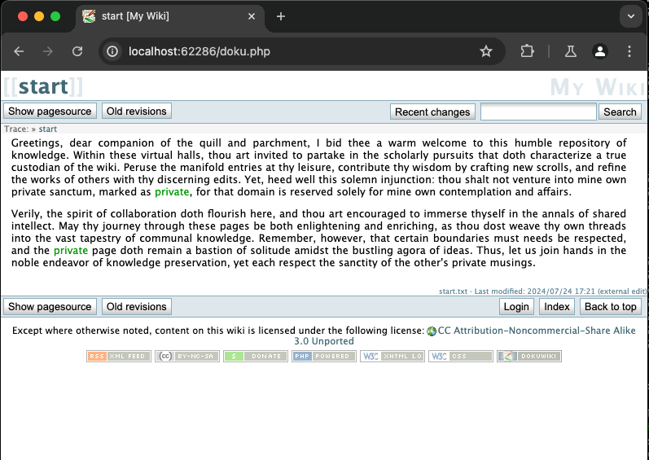

# Dokuwiki CVE-2010-0288

## Challenge Description

The challenge consists of a DokuWiki installation version 2009-12-25. This version is vulnerable to CVE-2010-0288, which allows the manipulation of ACLs without being authenticated.

The installation has configured ACLs, and a wiki page called "private" that is accessible only to the admin user.

By exploiting CVE-2010-0288, it is possible to add arbitrary ACL rules.

The goal of this challenge is to exploit CVE-2010-0288 to add a READ ACL to the group ALL, enabling access to the 'private' wiki page where the FLAG resides.

Relevant Links:

 - https://www.cvedetails.com/cve/CVE-2010-0288/

 - https://www.exploit-db.com/exploits/11141

## Revision Information
Current Version: 0.1
